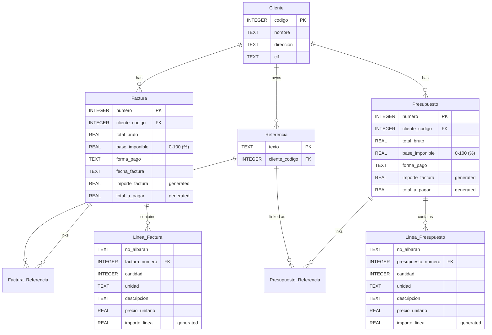

# Database schema

The application stores its data in a local **SQLite** database. The schema covers customers, invoices, budgets and the many-to-many references between them.

## Entity–relationship overview



## Tables

### Cliente (customer)

| Column | Type | Notes |
| --- | --- | --- |
| `codigo` | INTEGER | Primary key |
| `nombre` | TEXT | Required |
| `direccion` | TEXT | |
| `cif` | TEXT | Tax ID |

One customer holds many references and documents. Invoices/budgets with lines cannot delete their customer (`ON DELETE RESTRICT`).

### Referencia (delivery-note reference)

| Column | Type | Notes |
| --- | --- | --- |
| `texto` | TEXT | Primary key |
| `cliente_codigo` | INTEGER | FK → `Cliente.codigo`, `ON DELETE CASCADE` |

References are shared text identifiers owned by a customer and linked to documents through the pivot tables below.

### Factura (invoice)

| Column | Type | Notes |
| --- | --- | --- |
| `numero` | INTEGER | Primary key |
| `cliente_codigo` | INTEGER | FK → `Cliente.codigo` |
| `total_bruto` | REAL | Gross total, auto-maintained by triggers |
| `base_imponible` | REAL | Tax rate as a percentage, `CHECK` between 0 and 100 |
| `forma_pago` | TEXT | Payment method |
| `fecha_factura` | TEXT | Invoice date |
| `importe_factura` | REAL | **Generated**: `total_bruto * (base_imponible / 100)` |
| `total_a_pagar` | REAL | **Generated**: `total_bruto + importe_factura` |

### Linea_Factura (invoice line)

| Column | Type | Notes |
| --- | --- | --- |
| `no_albaran` | TEXT | |
| `factura_numero` | INTEGER | FK → `Factura.numero`, composite PK, `ON DELETE CASCADE` |
| `cantidad` | INTEGER | `CHECK >= 0` |
| `unidad` | TEXT | Unit |
| `descripcion` | TEXT | |
| `precio_unitario` | REAL | `CHECK >= 0` |
| `importe_linea` | REAL | **Generated**: `cantidad * precio_unitario` |

Primary key: `(factura_numero, no_albaran)`.

### Presupuesto (budget)

Mirrors `Factura`, plus:

| Column | Type | Notes |
| --- | --- | --- |
| `numero` | INTEGER | Primary key |
| `cliente_codigo` | INTEGER | FK → `Cliente.codigo` |

Same `total_bruto`, `base_imponible`, `forma_pago`, generated `importe_factura` and `total_a_pagar` columns.

### Linea_Presupuesto (budget line)

Same shape as `Linea_Factura` but references `presupuesto_numero` instead of `factura_numero`. Primary key: `(presupuesto_numero, no_albaran)`.

### Pivot tables

- `Factura_Referencia` — many-to-many between `Factura` and `Referencia` (`(factura_numero, referencia_texto)`).
- `Presupuesto_Referencia` — many-to-many between `Presupuesto` and `Referencia` (`(presupuesto_numero, referencia_texto)`).

Both cascade on delete and update.

## Triggers

Totals are recalculated automatically so the stored documents always stay consistent with their lines. Two families of triggers exist, one for invoices and one for budgets, each covering `INSERT`, `UPDATE` and `DELETE` on the line tables.

### Behaviour (invoice example)

- **After insert** on `Linea_Factura` → recompute `Factura.total_bruto` as `SUM(cantidad * precio_unitario)` for that invoice.
- **After update** on `Linea_Factura` → recompute the new invoice, and also recompute the previous invoice if the line was moved between invoices.
- **After delete** on `Linea_Factura` → recompute the affected invoice.

The same logic applies to budgets via the `Presupuesto_*` tables. Together with the generated columns, this means amounts like tax (`importe_factura`) and final total (`total_a_pagar`) are always derived from the raw gross total and tax rate.

## Amount model

```
total_bruto     = Σ (cantidad × precio_unitario)          ← maintained by triggers
importe_factura = total_bruto × (base_imponible / 100)    ← generated column (tax)
total_a_pagar   = total_bruto + importe_factura           ← generated column (gross + tax)
```